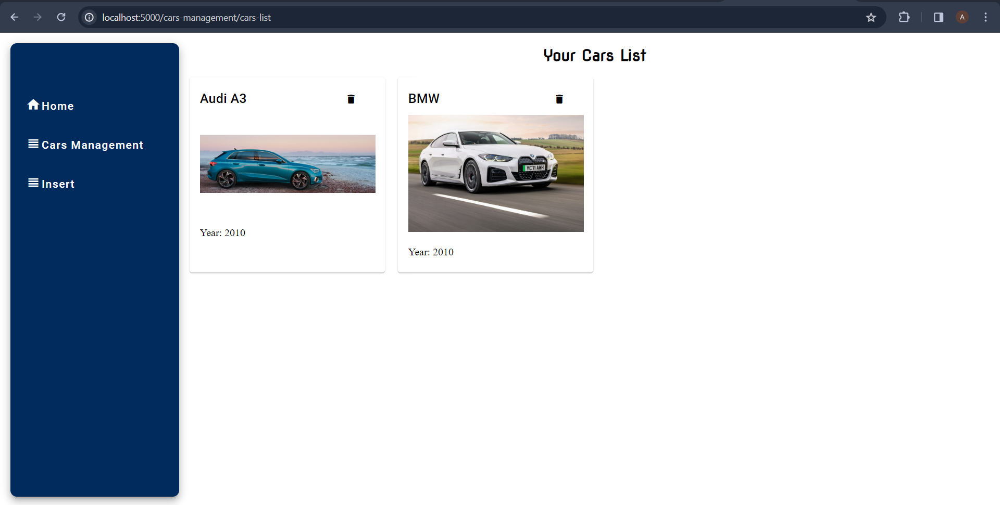
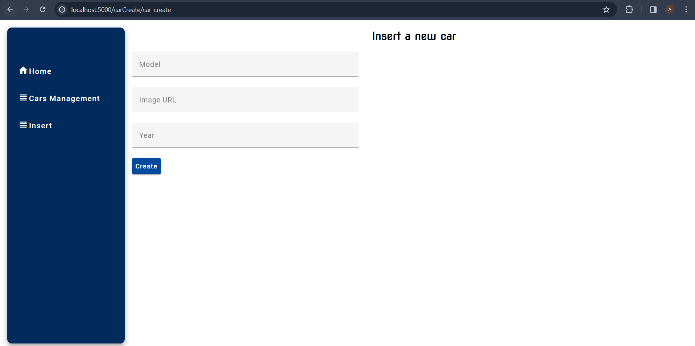
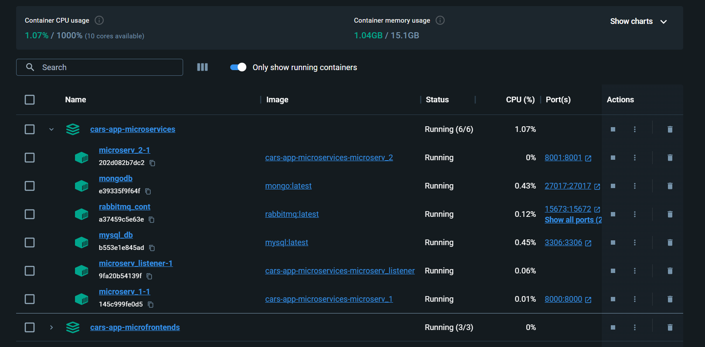
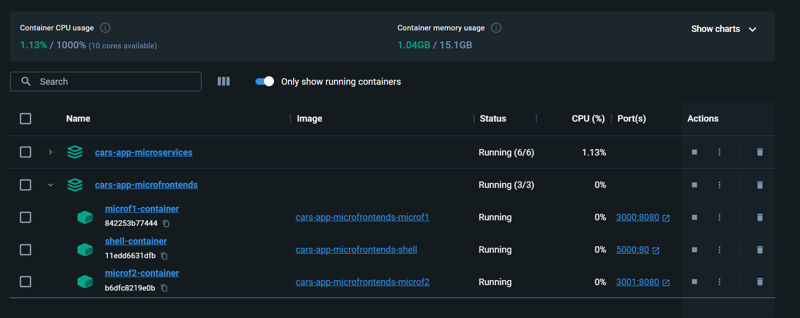
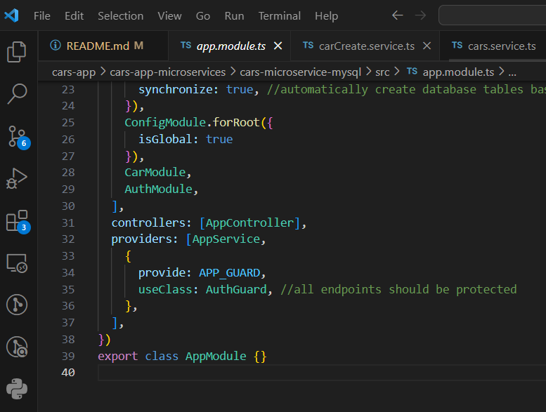
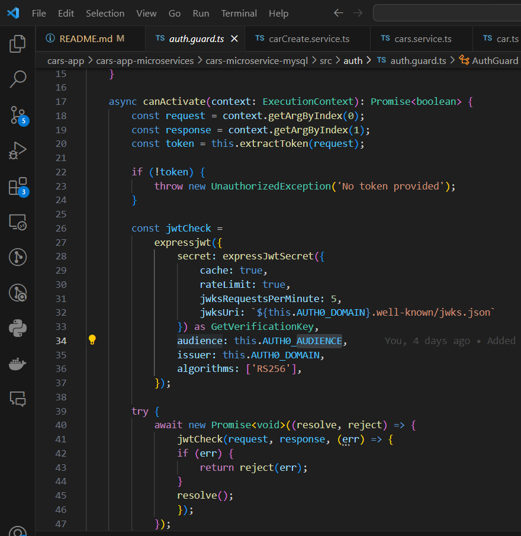
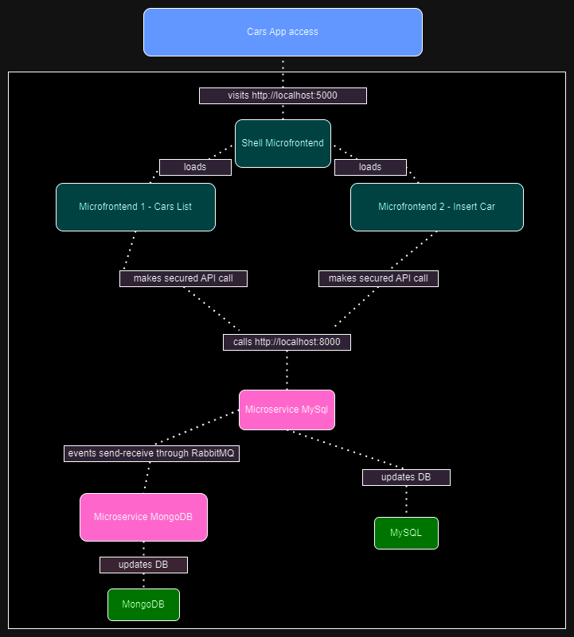
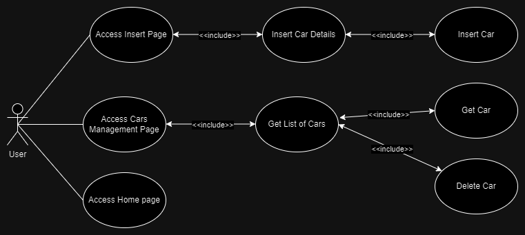

# Cars App
Cars App is a web applicaiton based on a **Web Server** for the backend and a **Web App for the frontend. On the backend side 2 microservices implemented using NestJS handle requests and manage data in MySQL and MongoDB. They communicate through RabbitMQ to sync events generated from the frontend that is split in 3 microfrontends written in Angular.

The system handles simple CRUD operations on the **Car** entity that has a model (string), year of production(number) and an image. 

## Workflows of the app ##
1. Insert a new car
    - User accesses the Insert page and fills in insert form (from **microfrontend2** that is displayed in the main layout of the app created by **shell microfrontend**)
    - A POST request is sent to microservice **cars-microservice-mysql** that inserts the new record in MySQL
    - **cars-microservice-mysql** emits a created event which is added in RabbitMQ queue
    - **cars-microservice-mongodb** listens to the RabbitMQ queue and gets the created event from which it takes the data of the new car and inserts it in MongoDB
2. Get the list of cars
    - User accesses the Cars Management page (from **microfrontend1** that is displayed in **shell**)
    - A GET request is sent to microservice **cars-microservice-mysql** and the list of cars is returned and displayed
3. Delete a car
    - User presses delete button on a car from the list (**microfrontend1**)
    - A DELETE request is sent to microservice **cars-microservice-mysql** 
    - **cars-microservice-mysql** emits a deleted event which is added in RabbitMQ queue
    - **cars-microservice-mongodb** listens to the RabbitMQ queue and deletes the corresponding record from MongoDB 

# Architecture and Technologies #
## Containers ##
### Docker ###
 - cars-app-microservices container images:
    
 - cars-app-microfrontends container images:
    
## Web Server ##
### Microservices ###
 - **cars-microservice-mysql**
    - NestJs controllers with CRUD operations
    - Connected to MYSQL
    - **Secured REST API** with Auth0
    
    
    - **Message broker RabbitMQ** emit event which adds in queue
 - **cars-microservice-mongodb**
    - NestJs controllers
    - Connected to MongoDB
    - **Message broker RabbitMQ** listen to events
## Web App ##
Microfrontends architecture in Angular using Webpack Module Federation plugin
- **shell**
    - Main layout of the app that loads the other microfrontends
- **microfrontend1**
    - Consumes REST API from **movies-microservice-mysql** (get, delete)
- **microfrontend2**
    - Consumes REST API from **movies-microservice-mysql** (create)

# C4 Model #

# UML #
